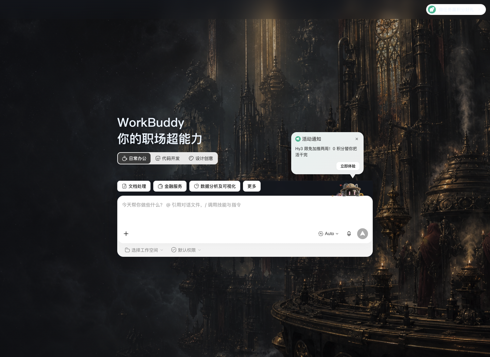

# WorkBuddy Dream Skin

给官方 WorkBuddy 桌面端换一张会呼吸的脸。

这是一个外部主题/壁纸引擎：通过 WorkBuddy 自带的本机 CDP 调试入口注入 CSS，
不修改 `WorkBuddy.app`、`app.asar` 或官方代码签名。侧栏、任务、输入框、文档预览
仍然是原生可交互控件。

> 非腾讯官方产品。WorkBuddy 及相关权利归其权利人。



## 当前状态

- macOS Apple Silicon：已在 WorkBuddy 5.3.3 / Electron 37.10.3 实机验证
- macOS Intel：菜单栏应用已提供 Universal Binary，等待更多实机回归
- Windows 10/11 x64：安装、托盘换图、验证和恢复流程已发布；首版等待用户实机反馈

当前是 `0.4.0` 技术预览版，支持 macOS 与 Windows，并通过 GitHub Release 自动生成
两个平台的下载 ZIP、SHA256 校验文件和版本页面。

## 安装

普通用户请从 [GitHub Releases](https://github.com/rachern3/WorkBuddy-Dream-Skin/releases)
下载对应平台的最新 ZIP。

### macOS

要求：

- macOS 12 或更高版本
- 已安装官方 `WorkBuddy.app`
- 启动前请确认 WorkBuddy 没有正在执行的任务，然后正常退出 WorkBuddy

下载仓库后，双击：

```text
Install WorkBuddy Dream Skin.command
```

安装器把独立引擎复制到：

```text
~/.workbuddy-dream-skin/studio
```

主题状态保存在：

```text
~/Library/Application Support/WorkBuddyDreamSkin
```

它不会把主题文件写进 WorkBuddy 的用户配置目录。

安装完成后，桌面会出现四个入口：

- `WorkBuddy Dream Skin.command`
- `WorkBuddy Dream Skin - Customize.command`
- `WorkBuddy Dream Skin - Verify.command`
- `WorkBuddy Dream Skin - Restore.command`

macOS 顶部菜单栏也会出现一个图片图标。这里可以直接选择新背景、切换以前保存的
背景、恢复项目内置背景，或恢复 WorkBuddy 官方外观。菜单栏工具会随登录自动启动；
若只想安装脚本，可从终端给安装器传入 `--no-menubar`。

### Windows

要求 Windows 10/11 64 位系统。下载 `WorkBuddy-Dream-Skin-vX.Y.Z-Windows.zip`，
如果文件属性里出现“解除锁定”，先勾选后再解压，然后双击：

```text
Install WorkBuddy Dream Skin - Windows.cmd
```

Windows 引擎安装到 `%LOCALAPPDATA%\WorkBuddyDreamSkin\engine`，桌面会创建启动、换图、
恢复快捷方式，系统托盘会提供保存主题、切换背景、验证和恢复官方外观。详见
[Windows 安装说明](docs/install-windows.md)。

## 使用

- `Start WorkBuddy Dream Skin.command`：以主题模式启动官方 WorkBuddy
- `Customize WorkBuddy Dream Skin.command`：选择自己的图片、保存主题并立即应用
- `Verify WorkBuddy Dream Skin.command`：校验签名、CDP 身份、样式和背景层
- `Restore WorkBuddy.command`：移除运行时并用普通模式重新打开 WorkBuddy
- `Install WorkBuddy Menu Bar.command`：单独重装顶部菜单栏快捷入口

启动器发现 WorkBuddy 已在普通模式运行时会拒绝强制关闭，避免中断后台任务。

## 更换自己的背景

安装后双击桌面的 `WorkBuddy Dream Skin - Customize.command`：

1. 在 macOS 文件选择器中挑选 PNG、JPEG、HEIC、TIFF 或 WebP 图片；
2. 给主题命名；
3. 图片会在本机转换并保存，然后立即应用到 WorkBuddy。

原图不会上传。用户主题保存在：

```text
~/Library/Application Support/WorkBuddyDreamSkin/themes
```

当前启用的主题保存在：

```text
~/Library/Application Support/WorkBuddyDreamSkin/current-theme
```

更新引擎不会删除这些目录。主题默认使用 `appearance: auto`，跟随 WorkBuddy 的
浅色/深色外观；当 WorkBuddy 跟随系统时，系统切换后主题也会同步切换。首页突出
壁纸；侧栏和输入区是连续玻璃层；任务页使用更薄的单层可读玻璃；助理、项目、
专家/技能/连接器、自动化和“更多”内的原生页面也会连续显示同一张背景。

图片原始大小必须小于等于 50 MiB，处理后的背景小于等于 16 MiB。推荐
2560×1440 的纯背景图，不要把带 UI 的截图当作背景。

### 关于“桥本有菜”本机背景

本机可导入原 Codex 项目中的 AI 示例图并设为默认背景，但该素材涉及真人拟像与再分发
权利确认，**不会进入公开 Release**。公开安装包只附带已确认可分发的 Gothic Void
Crusade；其他用户可以导入自己有权使用的图片。若未来取得明确的公开再分发授权，
再把该图片升级为所有用户都能下载的内置预设。

开发者仍可直接运行：

```bash
./scripts/customize-theme-macos.sh --image /absolute/path/to/image.png --name "我的主题"
```

## 安全边界

- CDP 仅允许绑定 `127.0.0.1`
- macOS 校验官方 Bundle ID、严格代码签名和腾讯 Team ID
- Windows 校验 `WorkBuddy.exe` Authenticode 签名、腾讯发行信息、产品元数据和端口监听进程路径
- WorkBuddy 5.3.3 会在签名包内生成腾讯文档编辑器日志和一个固定名称形式的 Python 缓存；仅允许这两个严格限定的运行时数据例外，嵌套代码签名仍须通过
- 只连接 WorkBuddy 主 Renderer，不注入登录页、网页预览或 WebView
- Restore 只停止本项目创建并记录的 launchd 作业
- Windows Restore 只停止状态文件中记录且进程身份匹配的注入器
- CDP 对同一系统用户下的其他本机进程没有认证；主题运行时不要执行不可信程序

更多实现与升级兼容策略见 [架构说明](docs/architecture.md)。

## 开发

```bash
npm test
npm run check
```

## 许可与归属

代码采用 MIT License。项目思路与部分结构源自
[Fei-Away/Codex-Dream-Skin](https://github.com/Fei-Away/Codex-Dream-Skin)，详见
[NOTICE.md](NOTICE.md)。内置 Gothic Void Crusade 预设请保留原作者归属；导入其他
图片前请自行确认使用与分发权。
